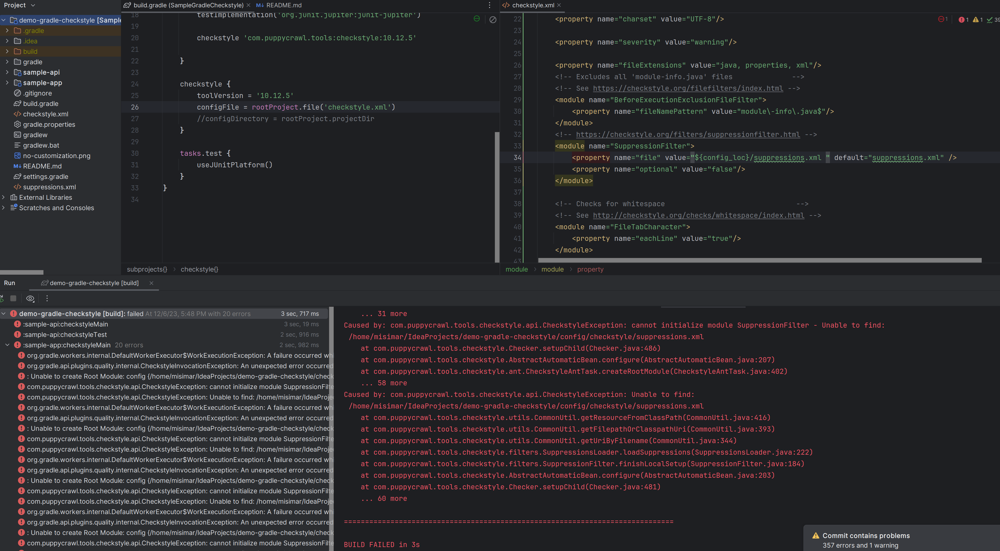

2 branches provided 

### Second is

>checkstyle-in-root-directory
> 

In this case `checkstyle.xml` and `supressions.xml` are
in the project root directory.  

It requires additional customization of checkstyle extension otherwise 
plugin unable to find `checkstyle.xml` and fails with errors.

Lets configure extension property `configFile` 
[link](https://docs.gradle.org/current/dsl/org.gradle.api.plugins.quality.CheckstyleExtension.html#org.gradle.api.plugins.quality.CheckstyleExtension:configFile)

Now the plugin finds `checkstyle.xml` as it states

> Caused by: : Unable to create Root Module: config {/home/${USER}/IdeaProjects/demo-gradle-checkstyle/checkstyle.xml}.

>Caused by: com.puppycrawl.tools.checkstyle.api.CheckstyleException: cannot initialize module SuppressionFilter - Unable to find: /home/misimar/IdeaProjects/demo-gradle-checkstyle/config/checkstyle/suppressions.xml

Plugin still looking for `supressions.xml` in default directory. 

### This can be solved using property `configDirectory`

This solves all problem with resolving `checkstyle.xml` and `suppressions.xml` files
but introduce new problem with some kind of task dependencies. 

## Solving task dependencies

This can be done manually using `dependsOn` but very tricky in multimodule 
project. Even if it solve for example for task `build` running another task 
still may raise the same problem. 

So far I noticed the problem affects when using subproject construction. 

